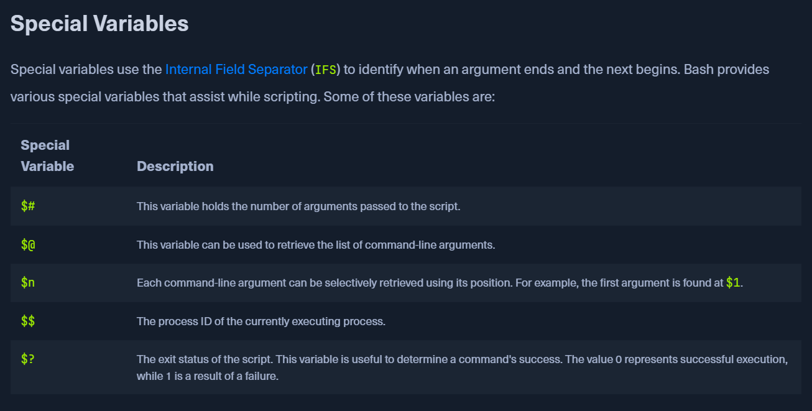

# BASH SCRIPTING

### Loops in Bash

1. **For loop (list)**

```bash
for item in a b c; do
    echo $item
done

```

1. **For loop (range)**

```bash
for i in {1..5}; do
    echo $i
done

```

1. **C-style For loop**

```bash
for ((i=1; i<=5; i++)); do
    echo $i
done

```

1. **While loop**

```bash
count=1
while [ $count -le 5 ]; do
    echo $count
    ((count++))
done

```

1. **Until loop** (runs until condition is true)

```bash
n=1
until [ $n -gt 5 ]; do
    echo $n
    ((n++))
done

```

1. **Infinite loop**

```bash
while true; do
    echo "Press Ctrl+C to stop"
done

```

### Arguments in Bash

- `$0` → script name (how it was called).
- `$1 … $9` → first nine arguments.
- `${10}, ${11}, …` → arguments beyond 9.
- `$#` → number of arguments.
- `$@` → all arguments (as separate words).
- `$*` → all arguments (as one string).

👉 You must use `$` to access them. Example:

```bash
#!/bin/bash
echo "Script name: $0"
echo "First arg: $1"
echo "Second arg: $2"

# Assigning arguments to variables
file=$1
user=$2
echo "File: $file, User: $user"

```

Run:

```bash
./myscript.sh data.txt admin

```

Output:

```
Script name: ./myscript.sh
First arg: data.txt
Second arg: admin
File: data.txt, User: admin

```



In contrast to other programming languages, there is no direct differentiation and recognition between the types of variables in Bash like "`strings`," "`integers`," and "`boolean`." All contents of the variables are treated as string characters. Bash enables arithmetic functions depending on whether only numbers are assigned or not. It is important to note when declaring variables that they do `not` contain a `space`. Otherwise, the actual variable name will be interpreted as an internal function or a command.

In contrast to other programming languages, there is no direct differentiation and recognition between the types of variables in Bash like "`strings`," "`integers`," and "`boolean`." All contents of the variables are treated as string characters. Bash enables arithmetic functions depending on whether only numbers are assigned or not. It is important to note when declaring variables that they do `not` contain a `space`. Otherwise, the actual variable name will be interpreted as an internal function or a command.

To compare specific values with each other, we need elements that are called [comparison operators](https://www.tldp.org/LDP/abs/html/comparison-ops.html). The `comparison operators` are used to determine how the defined values will be compared. For these operators, we differentiate between:

- `string` operators
- `integer` operators
- `file` operators
- `boolean` operators

---

# **String Operators**

If we compare strings, then we know what we would like to have in the corresponding value.

| **Operator** | **Description** |
| --- | --- |
| `==` | is equal to |
| `!=` | is not equal to |
| `<` | is less than in ASCII alphabetical order |
| `>` | is greater than in ASCII alphabetical order |
| `-z` | if the string is empty (null) |
| `-n` | if the string is not null |

# **Integer Operators**

Comparing integer numbers can be very useful for us if we know what values we want to compare. Accordingly, we define the next steps and commands how the script should handle the corresponding value.

| **Operator** | **Description** |
| --- | --- |
| `-eq` | is equal to |
| `-ne` | is not equal to |
| `-lt` | is less than |
| `-le` | is less than or equal to |
| `-gt` | is greater than |
| `-ge` | is greater than or equal to |

# **File Operators**

The file operators are useful if we want to find out specific permissions or if they exist.

| **Operator** | **Description** |
| --- | --- |
| `-e` | if the file exist |
| `-f` | tests if it is a file |
| `-d` | tests if it is a directory |
| `-L` | tests if it is if a symbolic link |
| `-N` | checks if the file was modified after it was last read |
| `-O` | if the current user owns the file |
| `-G` | if the file’s group id matches the current user’s |
| `-s` | tests if the file has a size greater than 0 |
| `-r` | tests if the file has read permission |
| `-w` | tests if the file has write permission |
| `-x` | tests if the file has execute permission |

# **Logical Operators**

With logical operators, we can define several conditions within one. This means that all the conditions we define must match before the corresponding code can be executed.

| **Operator** | **Description** |
| --- | --- |
| `!` | logical negotation NOT |
| `&&` | logical AND |
| `||` | logical OR |

### **Arithmetic Operators**

| **Operator** | **Description** |
| --- | --- |
| `+` | Addition |
| `-` | Subtraction |
| `*` | Multiplication |
| `/` | Division |
| `%` | Modulus |
| `variable++` | Increase the value of the variable by 1 |
| `variable--` | Decrease the value of the variable by 1 |

The control of the flow of our scripts is essential. We have already learned about the `if-else` conditions, which are also part of flow control. After all, we want our script to work quickly and efficiently, and for this, we can use other components to increase efficiency and allow error-free processing. Each control structure is either a `branch` or a `loop`. Logical expressions of boolean values usually control the execution of a control structure. These control structures include:

- Branches:
    - `If-Else` Conditions
    - `Case` Statements
- Loops:
    - `For` Loops
    - `While` Loops
    - `Until` Loops

# **Case Statements**

`Case` statements are also known as `switch-case` statements in other languages, such as C/C++ and C#. The main difference between `if-else` and `switch-case` is that `if-else` constructs allow us to check any boolean expression, while `switch-case` always compares only the variable with the exact value. Therefore, the same conditions as for `if-else`, such as "greater-than," are not allowed for `switch-case`. The syntax for the switch-case statements looks like this:

### **Syntax - Switch-Case**

Code: bash

```bash
case <expression> in
	pattern_1 ) statements ;;
	pattern_2 ) statements ;;
	pattern_3 ) statements ;;
esac
```

### **Method 1 - Functions**

Code: bash

```bash
function name {
	<commands>
}

```

### **Method 2 - Functions**

Code: bash

```bash
name() {
	<commands>
}
```

```bash
#!/bin/bash
function print_pars {
	echo $1 $2 $3
}

one="First parameter"
two="Second parameter"
three="Third parameter"

print_pars "$one" "$two" "$three"
```

Functions in Bash can work with fixed value structures or formats. For example, in **CIDR.sh**, the function `network_range` used the IP address format. Functions accept parameters like shell scripts do (`$1`–`$9` or `$variable`). Each function has its own parameter scope, so arguments don’t conflict with others or with the main script.

Unlike many languages, Bash variables are **global by default** unless declared with `local`. This means variables created inside a function can be accessed outside it. Parameters are passed the same way as to a script:

```bash
#!/bin/bash

function print_pars {
  echo $1 $2 $3
}

one="First parameter"
two="Second parameter"
three="Third parameter"

print_pars "$one" "$two" "$three"

```

### **Return.sh**

Code: bash

```bash
#!/bin/bashfunction given_args {

        if [ $# -lt 1 ]
        then
                echo -e "Number of arguments: $#"
                return 1
        else
                echo -e "Number of arguments: $#"
                return 0
        fi
}

# No arguments given
given_args
echo -e "Function status code: $?\n"

# One argument given
given_args "argument"
echo -e "Function status code: $?\n"

# Pass the results of the funtion into a variable
content=$(given_args "argument")echo -e "Content of the variable: \n\t$content"

```

### **Return.sh - Execution**

Functions

```bash
CSmarwen@htb[/htb]$ ./Return.shNumber of arguments: 0
Function status code: 1

Number of arguments: 1
Function status code: 0

Content of the variable:
    Number of arguments: 1
```

When it comes to debugging the our bash scripts to fix errors or change the logic we can use the following commands 

```bash
bash -x -v <bashScript.sh>
bash -x <bashScript.sh>
```

The option v is used for verbose and can be avoided