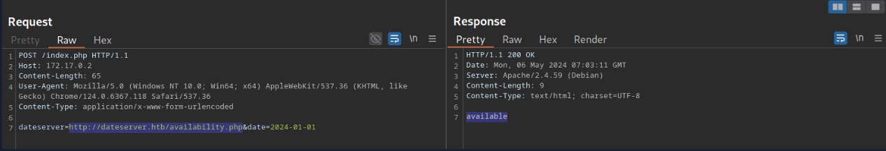
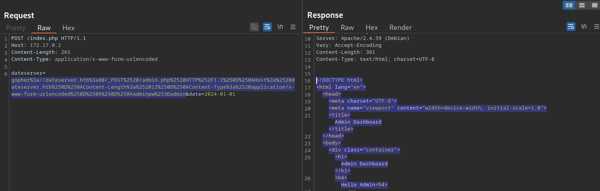
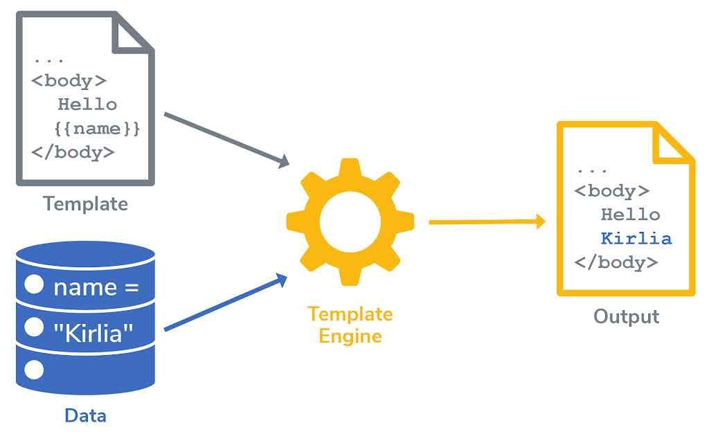
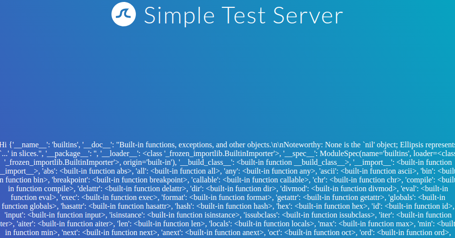

# Server Side Attacks

# The infamous SSRF

[Server-Side Request Forgery (SSRF)](https://owasp.org/www-community/attacks/Server_Side_Request_Forgery) is a vulnerability where an attacker can manipulate a web application into sending unauthorized requests from the server. This vulnerability often occurs when an application makes HTTP requests to other servers based on user input. Successful exploitation of SSRF can enable an attacker to access internal systems, bypass firewalls, and retrieve sensitive information.

# The infamous SSTI

Web applications can utilize templating engines and server-side templates to generate responses such as HTML content dynamically. This generation is often based on user input, enabling the web application to respond to user input dynamically. When an attacker can inject template code, a [Server-Side Template Injection](https://owasp.org/www-project-web-security-testing-guide/v41/4-Web_Application_Security_Testing/07-Input_Validation_Testing/18-Testing_for_Server_Side_Template_Injection) vulnerability can occur. SSTI can lead to various security risks, including data leakage and even full server compromise via remote code execution

# **The infamous SSI Injection(Server-Side Includes)**

Similar to server-side templates, server-side includes (SSI) can be used to generate HTML responses dynamically. SSI directives instruct the webserver to include additional content dynamically. These directives are embedded into HTML files. For instance, SSI can be used to include content that is present in all HTML pages, such as headers or footers. When an attacker can inject commands into the SSI directives, [Server-Side Includes (SSI) Injection](https://owasp.org/www-community/attacks/Server-Side_Includes_(SSI)_Injection) can occur. SSI injection can lead to data leakage or even remote code execution.

( Basically this kind of attack is identifiable with the extension of the html page, it would be something like .shtml and the code that is being ran by the server is commented inside) 

# **XSLT Server-Side Injection**

XSLT (Extensible Stylesheet Language Transformations) server-side injection is a vulnerability that arises when an attacker can manipulate XSLT transformations performed on the server. XSLT is a language used to transform XML documents into other formats, such as HTML, and is commonly employed in web applications to generate content dynamically. In the context of XSLT server-side injection, attackers exploit weaknesses in how XSLT transformations are handled, allowing them to inject and execute arbitrary code on the server.

# Specificity of SSRF

This section will be more technical and we will get to know every server side attack on its own in depth

## SSRF

[what-is-server-side-request-forgery.avif](what-is-server-side-request-forgery.avif)

### INTRO

**Server-Side Request Forgery (SSRF)** is a critical web security vulnerability, recognized in the OWASP Top 10, that arises when an application makes a request to a remote resource using a user-supplied URL. An attacker can exploit this by manipulating the provided URL, compelling the server to initiate unintended requests to arbitrary internal or external services.

This manipulation can lead to severe consequences. Attackers can leverage different URL schemes to escalate the attack:

- **`http://` and `https://`**: Used to scan the internal network, bypass firewalls, and access restricted administrative endpoints.
- **`file://`**: Allows the attacker to read arbitrary files from the server's local file system.
- **`gopher://`**: Enables sending custom data packets to other services, potentially facilitating attacks against internal databases or mail servers.

### IDENTIFICATION



We can identify the vulnerability by capturing requests sent by the web app for an external service of some sorts, in our example, when the user chooses an appointment this is the request that gets sent to the web app, the server gets the date with `dateserver` POST parameter, and then send it in a post request to the `index.php`  This is where we can find the vulnerability, if the user input isn’t sanitized we can make read source code and fully compromise the server in some cases.

To determine whether the HTTP response reflects the SSRF response to us, let us point the web application to itself by providing the URL `http://127.0.0.1/index.php`:


Since the response contains the web application's HTML code, the SSRF vulnerability is not blind, i.e., the response is displayed to us.

Since the data is displayed back to us, we can enumerate the system, check for open ports, simply by fuzzing the http://localhost:FUZZ/ and the wordlist would be a list of ports that we want t investigate.

### EXPLOTING

***Accessing Restricted Endpoints***

When we identify such vulnerability, there is a range of things that we can do. 

In the example provided, we can run a brute force attack on the domain dateserver.htb, because in our case and many cases, such servers aren’t accessible to normal users and besides they may be internal to the server we are originally attacking.

```bash
D3xt3rM0Rg4IV@htb[/htb]$ ffuf -w /opt/SecLists/Discovery/Web-Content/raft-small-words.txt -u http://172.17.0.2/index.php -X POST -H "Content-Type: application/x-www-form-urlencoded" -d "dateserver=http://dateserver.htb/FUZZ.php&date=2024-01-01" -fr "Server at dateserver.htb Port 80"<SNIP>

[Status: 200, Size: 361, Words: 55, Lines: 16, Duration: 3872ms]
    * FUZZ: admin
[Status: 200, Size: 11, Words: 1, Lines: 1, Duration: 6ms]
    * FUZZ: availability
```

***Local File Inclusion (LFI)***

We can use this in many cases, especially if we have a vulnerability chain and we already know some internal file names that we can include.

As seen a few sections ago, we can manipulate the URL scheme to provoke further unexpected behavior. Since the URL scheme is part of the URL supplied to the web application, let us attempt to read local files from the file system using the `file://` URL scheme. We can achieve this by supplying the URL `file:///etc/passwd` 

***The gopher Protocol***

THIS IS CRAZY! 

Let’s set up the scenario for our example and everything will be clear after.

As we have seen previously, we can use SSRF to access restricted internal endpoints. However, we are restricted to GET requests as there is no way to send a POST request with the `http://` URL scheme. For instance, let us consider a different version of the previous web application. Assuming we identified the internal endpoint `/admin.php` just like before, however, this time the response looks like this:


As we can see, the admin endpoint is protected by a login prompt. From the HTML form, we can deduce that we need to send a POST request to `/admin.php` containing the password in the `adminpw` POST parameter. However, there is no way to send this POST request using the `http://` URL scheme.

Instead, we can use the [gopher](https://datatracker.ietf.org/doc/html/rfc1436) URL scheme to send arbitrary bytes to a TCP socket. This protocol enables us to create a POST request by building the HTTP request ourselves.

Let’s suppose that the admin password is weak.

`gopher://dateserver.htb:80/_POST%20/admin.php%20HTTP%2F1.1%0D%0AHost:%20dateserver.htb%0D%0AContent-Length:%2013%0D%0AContent-Type:%20application/x-www-form-urlencoded%0D%0A%0D%0Aadminpw%3Dadmin`

When we inject this payload into the dateserver parameter it returns the admin dashboard HTML code.



The gopher protocol comes in handy when dealing with internal services over TCP, whatever the service may be HTTP;SSH..etc, but constructing payloads may be hard because it uses a special kind of syntax when it comes to URLs, we can use tools like Gopherus that will make the job easier. 

## Blind SSRF

### INTRO

Blind ssrf occurs when the response isn’t displayed back to us, this kind of vulnerability has generally less impact due to severely restricted exploitation vectors

### IDENTIFICATION

We can confirm the SSRF vulnerability just like we did before by supplying a URL to a system under our control and setting up a `netcat` listener

However, if we attempt to point the web application to itself, we can observe that the response does not contain the HTML response of the coerced request; instead, it simply lets us know that the date is unavailable. Therefore, this is a blind SSRF vulnerability:


This means that the accessed internal services or endpoints are dealt with server side and not displayed in the client side.

### EXPLOITATION

Exploiting blind SSRF vulnerabilities is generally severely limited compared to non-blind SSRF vulnerabilities. However, depending on the web application's behavior, we might still be able to conduct a (restricted) local port scan of the system, provided the response differs for open and closed ports. In this case, the web application responds with `Something went wrong!` for closed ports:


However, if a port is open and responds with a valid HTTP response, we get a different error message:


There is always a way to make something out of an identified vulnerability,

Depending on how the web application catches unexpected errors, we might be unable to identify running services that do not respond with valid HTTP responses. For instance, we are unable to identify the running MySQL service using this technique:


Furthermore, while we cannot read local files like before, we can use the same technique to identify existing files on the filesystem. That is because the error message is different for existing and non-existing files, just like it differs for open and closed ports:


For invalid files, the error message is different:


It all comes back to basic system enumeration, how the application catches and handles errors is the key to exploit this delicate vulnerability. 

To check for open ports we can use this ffuf command :

 `ffuf -w ./ports.txt -u http://172.17.0.2/index.php -X POST -H "Content-Type: application/x-www-form-urlencoded" -d "dateserver=http://127.0.0.1:FUZZ/&date=2024-01-01" -fr "Failed to connect to"`

# Specificity of SSTI


## Templating Engines



‘’’’’’’’’’’’ 

### The "Cookie Cutter" Analogy 🍪

Imagine you have a cookie cutter (the **template**). The shape of the cutter—say, a star—is always the same. This is like your website's header, footer, and sidebar. They don't change from page to page.

The cookie dough you use can have different ingredients (the **data**). One batch might be chocolate chip, another might be oatmeal raisin.

‘’’’’’’’’’’’’’

## INTRO

Template engines are safe when user input is treated as **data** to be placed into a template. However, Server-Side Template Injection (SSTI) vulnerabilities occur when an attacker's input is treated as part of the **template** itself, allowing them to execute code.
PS: the templating engine we will use for this section is Jinja

## IDENTIFICATION

Identify SSTI by injecting special characters used in template engines and observing the application's behavior. Use this test string to provoke errors:

`${{<%[%'"}}%\.`

This will work on all the templating engines and it doesn’t mean for sure that the application is vulnerable to ssti, yet!

### IDENTIFYING THE TEMPLATING ENGINE


Pretty clear picture I think no need to further explain.

### EXPLOITATION( Jinja2&Twig templating engines  )

Jinja is a template engine commonly used in Python web frameworks such as `Flask` or `Django`. This section will focus on a `Flask` web application. The payloads in other web frameworks might thus be slightly different.

***Information Disclosure*** 

We can exploit the SSTI vulnerability to obtain internal information about the web application, including configuration details and the web application's source code. For instance, we can obtain the web application's configuration using the following SSTI payload:

```
{{ config.items() }} ## this is for Ninja
{{ _self }} ## this is for Twig

```

Since this payload dumps the entire web application configuration, including any used secret keys, we can prepare further attacks using the obtained information. We can also execute Python code to obtain information about the web application's source code. We can use the following SSTI payload to dump all available built-in functions:

```
{{ self.__init__.__globals__.__builtins__ }} ## Ninja 
```



***LFI***

```
{{ self.__init__.__globals__.__builtins__.open("/etc/passwd").read() }} ## Ninja 
{{ "/etc/passwd"|file_excerpt(1,-1) }} ## Twig
```

***RCE***

<aside>
⚠️

**Key Function: `__import__`**
The `__import__` built-in function is critical for achieving Remote Code Execution in Jinja2 SSTI. It allows you to import Python modules like `os` to execute system commands.

`{{ self.__init__.__globals__.__builtins__.__import__('os').popen('id').read() }}`

</aside>

# Specificity of SSI

SSI is identifiable by the html extension such as `.shtml`, `.shtm`, and `.stm` 

## SSI direcirectives

SSI utilizes `directives` to add dynamically generated content to a static HTML page. These directives consist of the following components:

- `name`: the directive's name
- `parameter name`: one or more parameters
- `value`: one or more parameter values

An SSI directive has the following syntax:

```
<!--#name param1="value1" param2="value" -->
```

Here are some example ssi directives 

### **printenv**

This directive prints environment variables. It does not take any variables.

```
<!--#printenv -->

```

### **config**

This directive changes the SSI configuration by specifying corresponding parameters. For instance, it can be used to change the error message using the `errmsg` parameter:

```
<!--#config errmsg="Error!" -->
```

### **exec**

This directive executes the command given in the `cmd` parameter:

```
<!--#exec cmd="whoami" -->
```

### **include**

This directive includes the file specified in the `virtual` parameter. It only allows for the inclusion of files in the web root directory.

```
<!--#include virtual="index.html" -->
```

### **echo**

This directive prints the value of any variable given in the `var` parameter. Multiple variables can be printed by specifying multiple `var` parameters. For instance, the following variables are supported:

- `DOCUMENT_NAME`: the current file's name
- `DOCUMENT_URI`: the current file's URI
- `LAST_MODIFIED`: timestamp of the last modification of the current file
- `DATE_LOCAL`: local server time

```
<!--#echo var="DOCUMENT_NAME" var="DATE_LOCAL" -->
```

## **SSI Injection**

**SSI injection** happens when an attacker inserts malicious SSI directives into a file on a web server, which then executes them.

This typically occurs in two main ways:

- When a **vulnerable file upload** allows an attacker to add a file containing SSI directives.
- When a web application **writes user input directly into a file** that is later processed by the server.